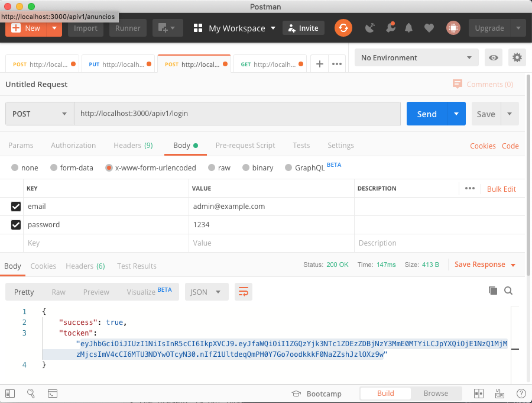
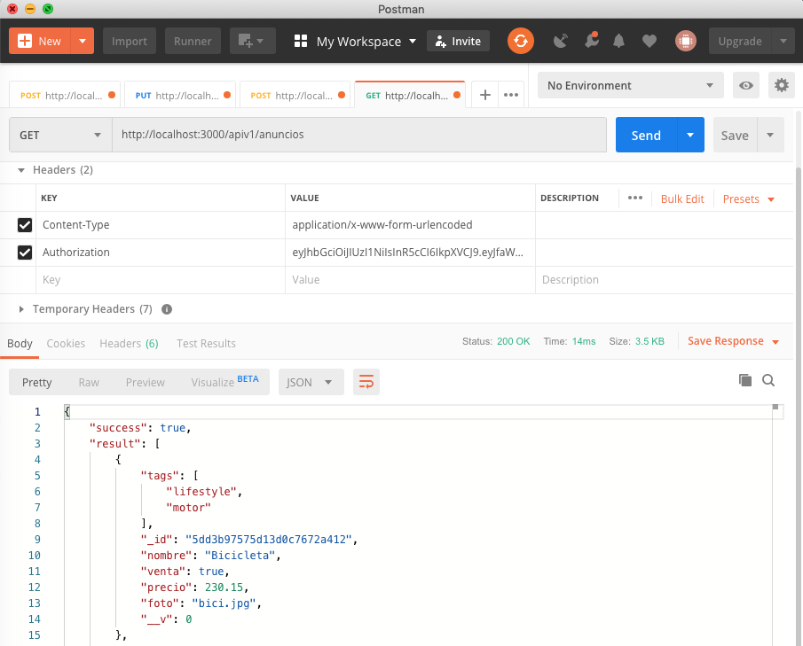
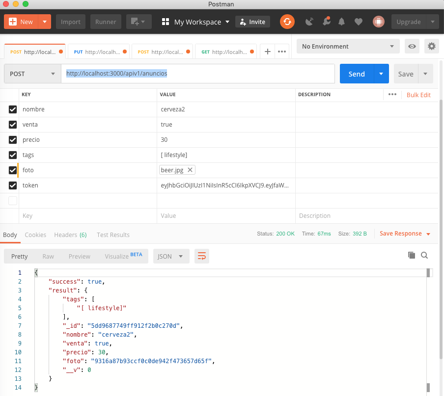
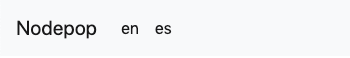

# README API PRACTICA NODE

## Iniciar aplicación modo develop:
```
npm run dev
```
## Iniciar la aplicación en modo normal o producción
```
npm run prod
```
## Iniciar base de datos de mongoDB
 ```
 ./bin/mongod --dbpath ./data/db --directoryperdb
```
## Inicializar la base de datos (limpiar bd y cargar anuncios.json con datos de anuncios y un usuario para probar el login)
```
npm run initDB
```

## Inicializar el servicio para la generación de thumbnails de las imagenes subidas en los anuncios
```
npm run thumnail
```

## API Métodos

### Lista de todos los anuncios
Para listar los anuncios primero debemos de realizar el login con
el email y contraseña, para que nos devuelva el token de autenticación, llamando una llamada con el método POST a:

http://localhost:3000/apiv1/login

Ejemplo con postman:



Una vez tenemos el token ya podemos realizar recuperar los anuncios, para ello tenemos que hacer una llamanda 
con el método GET:

http://localhost:3000/apiv1/anuncios

Tenemos que enviar el token para que nos devuelva el listado de anuncios, si no tenemos el token nos devolvera un error
o bien de token incorrecto o bien de token expirado.

Ejemplo de llamada al listado de anuncios con token correcto:



### Añadir anuncios
Para añadir un nuevo anuncio lo hacemos con un método POST desde http://localhost:3000/apiv1/anuncios. Para
que genere el thumbnail de la imagen tenemos que añadir en el campo foto que de tipo 'File' y subir la imagen,
en el campo value de postman. También es necesario añadir el token de login para poder añadir un nuevo
anuncio.

Ejemplo para añadir un nuevo anuncio por método post con postman:



Al hacer el send del método post tenemos que tener iniciado el Servicio de creación de thumbnails como se ha
indicado más arriba. Mandaremos la info en el body y con tipo form-data.
* Para la subida de anuncios se ha utilizado multer: https://github.com/expressjs/multer
* Para la hacer los thumbnails de 100x100 se ha utilizado JIMP: https://github.com/oliver-moran/jimp
* Para el microservicio de generación de thumnails se ha utilizado cote: https://github.com/dashersw/cote/blob/master/README.md

#### Parámetros:
  
  * limit: number. Limita el número de resultados retornados.
  * start: number. Para paginado, indica el número de registros que se salta
  * sort: string, ordena por el campo de anuncio indicado
  * tag: string, Muestra los anuncios que tengan el tag indicado
  * venta: boolean, valor true para listar los anuncios de venta, valor false para los que son de busqueda
  * nombre: string, busca los anuncios por el nombre, si coinciden los primeros cácteres también lista
  * precio: si ponemos un precio nos mostrara los que coincidan con el, si indicamos -50 nos lista los de
  menor a 50, si indicamos 50- mostrara los mayores a ese precio y si indicamos 50-100 mostrara los que 
  se encuentren estre ese rango de valores.

  * Ejemplo:
  http://localhost:3000/apiv1/anuncios?tag=mobile&venta=false&nombre=ip&precio=50-&start=0&limit=2&sort=precio
  
### Lista de los tags
Para listar los tags también necesitamos llamar con el token como en el caso de los anuncios.

http://localhost:3000/apiv1/anuncios/tags  

### Vista del listado de todos los anuncios utiliza los mismos parámetros que en el caso anterior
http://localhost:3000

## Internacionalización:
Se ha internacionalizado el listado de anuncios, para cambiar de idioma, se ha añadido un navbar en el que
se incluye un link 'es' y 'en' para poder cambiar de un idioma a otro. Para la intenacionalización se ha utilizado
i18n, https://www.npmjs.com/package/i18n



  * Ejemplo filtrado de anuncios:
  http://localhost:3000?tag=mobile&venta=false&nombre=ip&precio=50-&start=0&limit=2&sort=precio

### Iniciar eslint
```
npm run lint
```